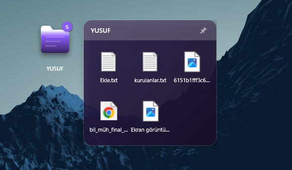
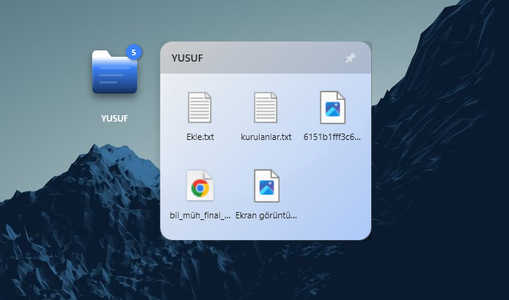
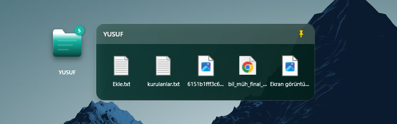

# 🗂️ FoldRa - Next Gen Desktop Folders

**Desktop Elegance Redefined** | **Masaüstü Zarafeti Yeniden Tanımlandı**

[English](#-english) | [Türkçe](#-türkçe)

---

## 📸 Visual Showcase / Görsel Şölen

| 🌌 Dark Elegance | ☀️ Light Clarity |
|:---:|:---:|
|  |  |

| 🟢 Panel Interaction | ⚙️ Powerful Settings |
|:---:|:---:|
|  |  |

---

# 🇬🇧 English

## 🚀 Unleash Productivity with FoldRa

**FoldRa** is not just a widget; it's a **desktop revolution**. Built with native C# performance, it transforms your chaotic desktop into a sleek, organized, and hyper-responsive workspace. Say goodbye to clutter and hello to the future of file management.

> *"It feels like it's part of Windows, but better."*

## ✨ Key Features

### ⚡ Ultrafast Performance
- **Zero Latency UI:** Experience butter-smooth updates and animations thanks to the optimized WPF rendering engine.
- **Micro-Memory Footprint:** Uses negligible RAM (~20MB), ensuring your games and heavy apps run without interference.
- **Smart Logic:** Files move physically on the same drive (instant) and reference-only across drives (safe), ensuring maximum speed and data integrity.

### � Stunning Aesthetics
- **Glassmorphism 2.0:** Beautiful, blurry translucent panels that adapt to your wallpaper.
- **Fluid Animations:** Every click, hover, and drag is accompanied by satisfying, 60fps animations.
- **Theme Engine:** Switch between Dark/Light modes or define your own custom colors.

### 🧠 Smart Features
- **File Magnet:** Drag files directly onto closed widgets to organize them instantly.
- **Auto-Resize:** Panels grow and shrink dynamically based on content—no wasted space.
- **Restoration Guarantee:** If you delete a widget, your files are harmlessly moved back to your desktop. No data loss, ever from FoldRa folder.

## ⚠️ Important Installation Note (SmartScreen)

When you run `FoldRa.exe` for the first time, you might see a **"Windows protected your PC"** (SmartScreen) warning.

**This is completely normal.** 
FoldRa is an open-source project and does not yet have an expensive digital billing certificate.

**To Install:**
1. Click **"More Info"** (Ek Bilgi)
2. Click **"Run Anyway"** (Yine de Çalıştır)

*Your safety is our priority. FoldRa is 100% open-source, and you can audit every line of code on this repository.*

## 🛠️ Installation

1. **Download Installer:** [FoldRa_Setup_v1.0.0.exe](Releases/FoldRa_Setup_v1.0.0.exe)
   *(Or check [Releases](https://github.com/YusufEren97/FoldRa/releases) for other versions)*
2. Run the setup file.
3. Allow past the SmartScreen warning (see above).
4. Enjoy your new desktop!

---

# 🇹🇷 Türkçe

## � FoldRa ile Masaüstü Devrimi

**FoldRa** sıradan bir widget uygulaması değil; **masaüstü deneyiminizin geleceğidir**. Native C# gücüyle geliştirilen FoldRa, dağınık masaüstünüzü saniyesinde şık, organize ve ultra-hızlı bir çalışma alanına dönüştürür. 

> *"Windows'un bir parçası gibi hissettiriyor, ama daha iyisi."*

## ✨ Özellikler

### ⚡ Işık Hızında Performans
- **Sıfır Gecikme (Zero Latency):** Optimize edilmiş WPF motoru sayesinde takılmayan, anlık tepkiler veren arayüz.
- **Minimum RAM Kullanımı:** Sadece ~20MB RAM tüketir. Oyunlarınızda veya ağır işlerinizde FPS düşüşüne asla sebep olmaz.
- **Akıllı Taşıma Mantığı:** Aynı diskteki dosyaları fiziksel taşır (anlık), farklı disktekileri referans alır. Verileriniz her zaman güvende ve işlemleriniz ışık hızında.

### 🎨 Büyüleyici Görsellik
- **Glassmorphism 2.0:** Masaüstü arka planınızla bütünleşen, bulanık ve şeffaf modern paneller.
- **Akıcı Animasyonlar:** Her tıklama, her sürükleme ve her açılış 60fps akıcılığında.
- **Tema Motoru:** İster Karanlık, ister Aydınlık mod kullanın veya klasörlerinize özel renkler atayın.

### 🧠 Akıllı Yetenekler
- **Dosya Mıknatısı:** Kapalı haldeki widget'a dosya sürüklediğinizde otomatik algılar ve içine alır.
- **Dinamik Boyutlandırma:** Dosya sildiğinizde veya eklediğinizde panel anında yeniden boyutlanır. Boşluk kalmaz.
- **Geri Yükleme Garantisi:** Bir widget'ı yanlışlıkla silseniz bile, içindeki dosyalar otomatik olarak masaüstünüze geri taşınır. Veri kaybı imkansız.

## ⚠️ Önemli Kurulum Notu (SmartScreen Uyarısı)

`FoldRa.exe`'yi ilk kez çalıştırdığınızda mavi renkli **"Windows kişisel bilgisayarınızı korudu"** uyarısı görebilirsiniz.

**Bu tamamen normaldir.**
FoldRa açık kaynaklı, ücretsiz bir projedir ve pahalı dijital imza sertifikalarına sahip değildir. Microsoft, tanımadığı her yeni uygulama için bu uyarıyı verir.

**Çalıştırmak İçin:**
1. **"Ek Bilgi"** yazısına tıklayın.
2. Altta çıkan **"Yine de Çalıştır"** butonuna tıklayın.

*Güvenliğiniz önceliğimizdir. FoldRa %100 açık kaynaktır ve kodlarını bu sayfadan inceleyebilirsiniz.*

## 🛠️ Kurulum

1. **İndir:** [FoldRa_Setup_v1.0.0.exe](Releases/FoldRa_Setup_v1.0.0.exe)
   *(Veya [Releases](https://github.com/YusufEren97/FoldRa/releases) sayfasından kontrol edin)*
2. Kurulum dosyasını çalıştırın.
3. SmartScreen uyarısını geçin (yukarıya bakın).
4. Yeni masaüstünüzün keyfini çıkarın!

---

## 📄 License / Lisans

This project is licensed under the MIT License.  
Bu proje MIT Lisansı ile açık kaynak olarak sunulmaktadır.

---

**Crafted with ❤️ by [YusufEren97](https://github.com/YusufEren97)**

